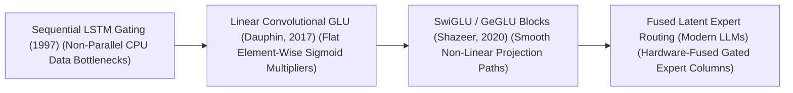
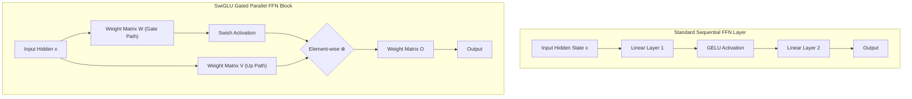

# Awesome-Gated-Linear-Units
## Gated Linear Units (GLUs) in AI: History, Progression, Variants, & Applications

A **Gated Linear Unit (GLU)** is an architectural neural network layer and non-linear activation mechanism designed to control the flow of information through deep neural networks using a parameterized gating block. First mathematically formalized by Yann N. Dauphin et al. in 2017 ("Language Modeling with Gated Linear Units"), GLUs replace traditional scalar activation functions (such as ReLU, GELU, or Swish) with an element-wise multiplication of two parallel linear projections, where one projection acts as a dynamic multiplier ("gate") over the other. 

By modeling non-linearities through data-dependent multiplicative interactions rather than fixed geometric thresholds, GLUs mitigate the vanishing gradient problem, improve optimization convergence stability, and dramatically expand the expressive capacity of the model. In the modern era of foundational AI, specialized GLU variants serve as the default structural component underpining the Feed-Forward Network (FFN) blocks of leading Large Language Models.

---

## 1. The Macro Chronological Evolution

The technical implementation of gating activations has transitioned from rigid multi-step LSTM gates to flat linear convolutional gating, moving toward smooth, non-linear Swish and GELU transformer projection blocks.

| Era / Concept | Description | Year | Paper | Details |
|---|---|---|---|---|
| The Sequential Recurrent Gating Era (LSTM / GRU) | The historical baseline of gated neural networks. Recurrent cells like LSTM introduced explicit input, forget, and output gates to create a linear memory highway. | 1997 | [Hochreiter & Schmidhuber, 1997](https://doi.org/10.1162/neco.1997.9.8.1735) | [Read more](LSTM-GRU.md) |
| The Flat Convolutional Gating Revolution (Vanilla GLU) | Ported gating mechanics out of recurrent dependencies and straight into parallelizable convolutional networks. Dauphin et al. split a layer's projection matrix into two parallel paths. | 2017 | [Dauphin et al., 2017](https://arxiv.org/abs/1612.08083) | [Read more](Vanilla-GLU.md) |
| The Smooth Non-Linear Projection Era (SwiGLU / GeGLU) | Perfected gating mechanics for Transformer architectures by replacing the flat Sigmoid operator with state-of-the-art smooth, non-linear activation functions. | 2020 | [Shazeer, 2020](https://arxiv.org/abs/2002.05202) | [Read more](SwiGLU-GeGLU.md) |
| The Fused Latent Parallel MoE Era | The current modern state-of-the-art foundation infrastructure standard. It ports SwiGLU gating out of dense multi-layer networks and straight into sparsely routed architectures. | 2024 | [DeepSeek-AI, 2024](https://arxiv.org/abs/2401.06066) | [Read more](Fused-Latent-Parallel-MoE.md) |

---

## 2. Core Functional & Algorithmic Variants

The Gated Linear Unit family tree is strictly categorized based on the specific mathematical activation functions applied to the gating projection branch.

| Variant | Mechanism / Pros | Year | Paper | Details |
|---|---|---|---|---|
| A. Vanilla GLU (Sigmoid-Gated Linear) | Multiplies a linear projection by the Sigmoid transformation of a parallel projection. The Sigmoid function acts as a soft binary switch. | 2017 | [Dauphin et al., 2017](https://arxiv.org/abs/1612.08083) | [Read more](Vanilla-GLU-Variant.md) |
| B. SwiGLU (Swish/SiLU Gated Linear) | Replaces the Sigmoid operator with the Swish activation function, omitting the bias terms to streamline hardware execution. | 2020 | [Shazeer, 2020](https://arxiv.org/abs/2002.05202) | [Read more](SwiGLU-Variant.md) |
| C. GeGLU (GELU Gated Linear) | Leverages the Gaussian Error Linear Unit (GELU) to modulate the gating pathway. | 2020 | [Shazeer, 2020](https://arxiv.org/abs/2002.05202) | [Read more](GeGLU-Variant.md) |
| D. ReGLU (ReLU Gated Linear) | Uses a simple rectified linear unit (ReLU) to shape the gating channel. Computationally cheaper than SwiGLU or GeGLU. | 2020 | [Shazeer, 2020](https://arxiv.org/abs/2002.05202) | [Read more](ReGLU-Variant.md) |

---

## 3. The SwiGLU FFN Layer Matrix

To implement SwiGLU layers inside a Transformer's Feed-Forward Network (FFN) block without increasing computing latencies, architectures expand parameter columns to execute single-pass matrix fusions.

| Component | Profile / Description | Year | Paper | Details |
|---|---|---|---|---|
| Fused Input Projection Kernels | Collapses model memory lookups. To prevent launching two separate, sequential GPU kernel executions for the Gate path and the Up path. | 2022 | [Dao et al., 2022 (FlashAttention)](https://arxiv.org/abs/2205.14135) | [Read more](Fused-Input-Projection-Kernels.md) |
| The $3d_{\text{ffn}}$ Column Scaling Matrix | Manages parameter balancing. To maintain a fair compute comparison against dense baselines, intermediate dimension is downscaled. | 2020 | [Shazeer, 2020](https://arxiv.org/abs/2002.05202) | [Read more](3d-ffn-Column-Scaling-Matrix.md) |

---

## 4. Production Engineering Challenges & Hardware Solutions

Deploying and scaling complex GLU-based parallel architectures across large-scale distributed training clusters introduces unique VRAM memory and kernel execution constraints.

| Challenge | Problem & Mitigation | Year | Paper | Details |
|---|---|---|---|---|
| The FlashAttention Kernel Memory Allocation Gap | Fusing the input projections creates massive activation tensor fields... Mitigated by deploying custom handwritten Triton or CUDA kernels. | 2022 | [Dao et al., 2022](https://arxiv.org/abs/2205.14135) | [Read more](FlashAttention-Kernel-Memory-Allocation-Gap.md) |
| The Parameter-Heterogeneity Expert Load-Imbalance Wall | When sharding a model's parallel GLU layers, column-parallel allocations must balance processing steps perfectly. Mitigated by Device-Aware Topology Routing. | 2021 | [Fedus et al., 2021 (Switch Transformers)](https://arxiv.org/abs/2101.03961) | [Read more](Parameter-Heterogeneity-Expert-Load-Imbalance.md) |

---

## 5. Frontier Real-World AI Industrial Applications

| Application | Description | Year | Paper | Details |
|---|---|---|---|---|
| Pre-Training Web-Scale Foundational LLM Suites (Llama / DeepSeek) | Serves as the standard default FFN activation backbone used to train elite base architectures. | 2023 | [Touvron et al., 2023 (Llama)](https://arxiv.org/abs/2302.13971) | [Read more](Pre-Training-Web-Scale-Foundational-LLMs.md) |
| Low-Latency Real-Time Cloud Inference Serving Engines (vLLM Deployments) | Compresses model generation response latency within enterprise software endpoints. | 2023 | [Kwon et al., 2023 (vLLM)](https://arxiv.org/abs/2309.06180) | [Read more](Low-Latency-Real-Time-Cloud-Inference.md) |
| Autonomous Vehicle Multimodal Bird's-Eye-View Perception | Ingests real-time streaming high-res camera video and LiDAR 3D coordinates concurrently. | 2022 | [Li et al., 2022 (BEVFormer)](https://arxiv.org/abs/2203.17270) | [Read more](Autonomous-Vehicle-Multimodal-BEV.md) |

---

## References
1. Dauphin, Y. N., et al. (2017). Language modeling with gated linear units. *Proceedings of the 34th International Conference on Machine Learning (ICML)*, 933-1141.
2. Hendrycks, D., & Gimpel, K. (2016). Gaussian error linear units (GELUs). *arXiv preprint arXiv:1606.08415*.
3. Ramachandran, P., Zoph, B., & Le, Q. V. (2017). Searching for activation functions (Swish/SiLU). *arXiv preprint arXiv:1710.05941*.
4. Shazeer, N. (2020). GLU variants improve transformer. *arXiv preprint arXiv:2002.05202*.
5. Touvron, H., et al. (2023). Llama: Open and efficient foundation language models. *arXiv preprint arXiv:2302.13971*.
6. DeepSeek-AI. (2025). DeepSeek-V3 Technical Report: Fused multi-head latent parallel attention and sharded SwiGLU expert scaling protocols over distributed hardware clusters. *GitHub Repository Technical Infrastructure Manifesto*.

---

To advance this section of your repository, structural framework setup, or post-training deployment pipeline, consider pursuing these adjacent development pathways:
* Build a **Python code snippet using PyTorch** illustrating how to construct a functional SwiGLU Feed-Forward Network module from scratch, including weight parameter declarations and single-pass matrix fusions.
* Generate a **comprehensive Markdown table** explicitly comparing Standard ReLU FFN, Standard GELU FFN, Vanilla GLU (Sigmoid), SwiGLU, and GeGLU across mathematical equation definitions, active parameter count ratios ($2d$ vs $3d$), continuous differentiability properties, and empirical training convergence velocities.
* Establish a **performance evaluation harness using Triton** to track the exact computational token-per-second throughput and memory bus bandwidth savings achieved when compiling a fused SwiGLU input projection and element-wise activation pass directly inside an active GPU register block.

***

**Follow-Up Options Matrix:**

Before updating this documentation repository layout, let me know how you would like to proceed by choosing one of the options below:
* I can provide a **complete Python code boilerplate using PyTorch** demonstrating how to write an automated script that packs SwiGLU gate and up-projection weights into a single unified tensor layout.
* I can generate a **Markdown matrix table** tracking the explicit hidden layer dimensions, intermediate widths ($d_{\text{ffn}}$), and activation types utilized by leading foundation repositories to configure high-performance FFN blocks.
* I can write a detailed technical explanation focusing on the **mathematical derivation of gradient propagation bounds** through a SwiGLU layer, explaining why it eliminates the dead-neuron optimization problem typical of hard threshold functions.

