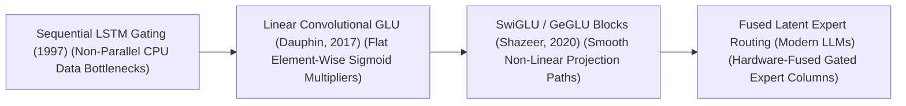
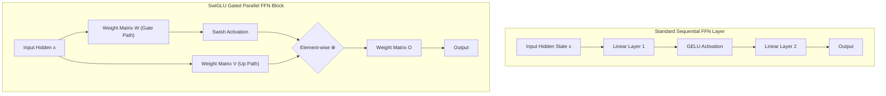

# Awesome-Gated-Linear-Units
## Gated Linear Units (GLUs) in AI: History, Progression, Variants, & Applications

A **Gated Linear Unit (GLU)** is an architectural neural network layer and non-linear activation mechanism designed to control the flow of information through deep neural networks using a parameterized gating block. First mathematically formalized by Yann N. Dauphin et al. in 2017 ("Language Modeling with Gated Linear Units"), GLUs replace traditional scalar activation functions (such as ReLU, GELU, or Swish) with an element-wise multiplication of two parallel linear projections, where one projection acts as a dynamic multiplier ("gate") over the other. 

By modeling non-linearities through data-dependent multiplicative interactions rather than fixed geometric thresholds, GLUs mitigate the vanishing gradient problem, improve optimization convergence stability, and dramatically expand the expressive capacity of the model. In the modern era of foundational AI, specialized GLU variants serve as the default structural component underpining the Feed-Forward Network (FFN) blocks of leading Large Language Models.

---

## 1. The Macro Chronological Evolution

The technical implementation of gating activations has transitioned from rigid multi-step LSTM gates to flat linear convolutional gating, moving toward smooth, non-linear Swish and GELU transformer projection blocks.

*   **The Sequential Recurrent Gating Era (LSTM / GRU, ~1997–2017)**
    *   *Concept:* The historical baseline of gated neural networks. Recurrent cells like **Long Short-Term Memory (LSTM)** architectures introduced explicit input, forget, and output gates to create a linear memory highway.
    *   *Limitation:* Catastrophically memory-bandwidth bound and non-parallelizable. Because recurrent step $t+1$ depends strictly on step $t$ finishing, the gating computations could not scale efficiently across parallel GPU clusters during training.
*   **The Flat Convolutional Gating Revolution (Vanilla GLU, Dauphin et al., 2017)**
    *   *Concept:* Ported gating mechanics out of recurrent dependencies and straight into parallelizable convolutional networks. Dauphin et al. split a layer's projection matrix into two parallel paths: one path is mapped via a standard linear layer, while the twin path passes through a Sigmoid activation function ($\sigma$) to function as a bounded gating array $[0, 1]$. The paths are combined via an element-wise product ($\otimes$).
    *   *Significance:* Allowed the entire gating sequence to parallelize cleanly across GPU arrays, dropping training times significantly while outperforming traditional recurrent language models on large-scale text corpuses.
*   **The Smooth Non-Linear Projection Era (SwiGLU / GeGLU, Shazeer, 2020)**
    *   *Concept:* Perfected gating mechanics for Transformer architectures by replacing the flat Sigmoid operator with state-of-the-art smooth, non-linear activation functions. Noam Shazeer (Google Shay) introduced the **SwiGLU** and **GeGLU** variants. Instead of a linear gate, the gating branch is wrapped inside a **Swish/SilU** or **GELU** activation curve before executing the element-wise multiplication step.
    *   *Significance:* Became the undisputed architectural default standard underpining modern high-performance foundation models (such as Llama 3 and Mistral), delivering major perplexity and convergence gains out-of-the-box.
*   **The Fused Latent Parallel MoE Era (~2024–Present)**
    *   *Concept:* The current modern state-of-the-art foundation infrastructure standard. It ports SwiGLU gating out of dense multi-layer networks and straight into sparsely routed architectures (such as DeepSeek-V3). 
    *   *Significance:* It merges SwiGLU FFN structures natively inside **Mixture-of-Experts (MoE)** blocks. The input gating projections, up-scaling matrices, and expert-routing column allocations are calculated concurrently inside fast GPU SRAM registers, maximizing cluster parameter density while bypassing global memory bus loops.

---

## 2. Core Functional & Algorithmic Variants

The Gated Linear Unit family tree is strictly categorized based on the specific mathematical activation functions applied to the gating projection branch.

- ### A. Vanilla GLU (Sigmoid-Gated Linear)
	*   **Mechanism:** Multiplies a linear projection $xW + b$ by the Sigmoid transformation of a parallel projection $xV + c$:
	    $$\text{GLU}(x, W, V, b, c) = (xW + b) \otimes \sigma(xV + c)$$
	*   **Behavior:** The Sigmoid function acts as a soft binary switch, dynamically dampening or amplifying signals based on data context.

- ### B. SwiGLU (Swish/SiLU Gated Linear)
	*   **Mechanism:** Replaces the Sigmoid operator with the Swish (or Silicon Linear Unit - SiLU) activation function, omitting the bias terms to streamline hardware execution:
	    $$\text{SwiGLU}(x, W, V) = \text{Swish}_\beta(xW) \otimes xV$$
	    Where $\text{Swish}_\beta(x) = x \cdot \sigma(\beta x)$.
	*   **Downstream Application:** The standard default FFN backbone configuration for almost all modern open-weight LLMs (e.g., Llama, Mistral, Qwen).

- ### C. GeGLU (GELU Gated Linear)
	*   **Mechanism:** Leverages the Gaussian Error Linear Unit (GELU) to modulate the gating pathway:
	    $$\text{GeGLU}(x, W, V) = \text{GELU}(xW) \otimes xV$$
	*   **Pros:** Highly popular in early multimodal and text-to-image architectures, providing clean gradient tracking through stochastic probability thresholds.

- ### D. ReGLU (ReLU Gated Linear)
	*   **Mechanism:** Uses a simple rectified linear unit (ReLU) to shape the gating channel:
	    $$\text{ReGLU}(x, W, V) = \max(0, xW) \otimes xV$$
	*   **Pros:** Computationally cheaper than SwiGLU or GeGLU because it avoids exponential calculations, though it sacrifices a fraction of modeling expressiveness due to the hard zero-boundary of ReLU.

---

## 3. The SwiGLU FFN Layer Matrix

To implement SwiGLU layers inside a Transformer's Feed-Forward Network (FFN) block without increasing computing latencies, architectures expand parameter columns to execute single-pass matrix fusions.

*   **Fused Input Projection Kernels**
    *   *Profile:* Collapses model memory lookups. To prevent launching two separate, sequential GPU kernel executions for the Gate path ($W$) and the Up path ($V$), the system stacks the matrices on disk as a single unified weight tensor, executing both projections in a single continuous hardware step inside fast registers.
*   **The $3d_{\text{ffn}}$ Column Scaling Matrix**
    *   *Profile:* Manages parameter balancing. Standard FFN layers utilize two weight matrices ($2 \times d_{model} \times d_{\text{ffn}}$). Because a GLU block splits the input step into two parallel matrices ($W$ and $V$) before running the output down-projection ($W_o$), it requires three distinct weight matrices ($3 \times d_{model} \times d_{\text{ffn}}$). To maintain a fair compute comparison against dense baselines, infrastructure teams downscale the intermediate dimension hidden width down to approximately $\frac{2}{3} \times 4d_{model}$.

---

## 4. Production Engineering Challenges & Hardware Solutions

Deploying and scaling complex GLU-based parallel architectures across large-scale distributed training clusters introduces unique VRAM memory and kernel execution constraints.

*   **The FlashAttention Kernel Memory Allocation Gap**
    *   *The Problem:* Fusing the input projections of parallel gating layers creates massive activation tensor fields inside the hidden layers. During large training batch passes, this causes intermediate activation memory to swell, bottlenecking global GPU memory bandwidth and triggering system-wide Out-of-Memory crashes.
    *   *Mitigation:* Deploying custom **handwritten Triton or CUDA kernels** that handle the SwiGLU element-wise multiplication and activation tracking natively within fast, on-chip GPU SRAM registers, evicting non-boundary activation arrays immediately before global High Bandwidth Memory (HBM) storage occurs.
*   **The Parameter-Heterogeneity Expert Load-Imbalance Wall**
    *   *The Problem:* When sharding a model's parallel GLU layers across a **Tensor Parallelism (TP)** or sparse Mixture-of-Experts group, column-parallel allocations must balance processing steps perfectly. If data routing dispatches highly complex token streams to a single expert node irregularly, that node bottlenecks the cluster, forcing all other GPUs to sit idle in dead wait cycles.
    *   *Mitigation:* Implementing **Device-Aware Topology Routing**, group-partitioning expert data layouts to match high-speed intra-node NVLink lanes, coupled with token-dropping heuristics to clamp maximum cluster communication payloads.

---

## 5. Frontier Real-World AI Industrial Applications

*   **Pre-Training Web-Scale Foundational LLM Suites (Llama / DeepSeek)**
    *   *Application:* Serves as the standard default FFN activation backbone used to train elite base architectures. SwiGLU gating networks maximize parameter expressiveness over multi-trillion token corpuses, allowing models to internalize highly intricate mathematical log-probabilities, source code syntaxes, and multilingual rules with high data efficiency.
*   **Low-Latency Real-Time Cloud Inference Serving Engines (vLLM Deployments)**
    *   *Application:* Compresses model generation response latency within enterprise software endpoints. By replacing traditional sequential networks with parallelized, fused GLU architectures compiled via TensorRT-LLM, cloud providers compress **Time-to-First-Token (TTFT)** metrics significantly, boosting query concurrency thresholds cheaply.
*   **Autonomous Vehicle Multimodal Bird's-Eye-View Perception**
    *   *Application:* Ingests real-time streaming high-res camera video and LiDAR 3D coordinates concurrently. Deep vision-transformer or ConvNeXt backbones process visual patch grids through parallel GeGLU or SwiGLU layers, mapping spatial features stably into unified Bird's-Eye-View (BEV) coordinates to execute safe obstacle tracking.

---

## References
1. Dauphin, Y. N., et al. (2017). Language modeling with gated linear units. *Proceedings of the 34th International Conference on Machine Learning (ICML)*, 933-1141.
2. Hendrycks, D., & Gimpel, K. (2016). Gaussian error linear units (GELUs). *arXiv preprint arXiv:1606.08415*.
3. Ramachandran, P., Zoph, B., & Le, Q. V. (2017). Searching for activation functions (Swish/SiLU). *arXiv preprint arXiv:1710.05941*.
4. Shazeer, N. (2020). GLU variants improve transformer. *arXiv preprint arXiv:2002.05202*.
5. Touvron, H., et al. (2023). Llama: Open and efficient foundation language models. *arXiv preprint arXiv:2302.13971*.
6. DeepSeek-AI. (2025). DeepSeek-V3 Technical Report: Fused multi-head latent parallel attention and sharded SwiGLU expert scaling protocols over distributed hardware clusters. *GitHub Repository Technical Infrastructure Manifesto*.

---

To advance this section of your repository, structural framework setup, or post-training deployment pipeline, consider pursuing these adjacent development pathways:
* Build a **Python code snippet using PyTorch** illustrating how to construct a functional SwiGLU Feed-Forward Network module from scratch, including weight parameter declarations and single-pass matrix fusions.
* Generate a **comprehensive Markdown table** explicitly comparing Standard ReLU FFN, Standard GELU FFN, Vanilla GLU (Sigmoid), SwiGLU, and GeGLU across mathematical equation definitions, active parameter count ratios ($2d$ vs $3d$), continuous differentiability properties, and empirical training convergence velocities.
* Establish a **performance evaluation harness using Triton** to track the exact computational token-per-second throughput and memory bus bandwidth savings achieved when compiling a fused SwiGLU input projection and element-wise activation pass directly inside an active GPU register block.

***

**Follow-Up Options Matrix:**

Before updating this documentation repository layout, let me know how you would like to proceed by choosing one of the options below:
* I can provide a **complete Python code boilerplate using PyTorch** demonstrating how to write an automated script that packs SwiGLU gate and up-projection weights into a single unified tensor layout.
* I can generate a **Markdown matrix table** tracking the explicit hidden layer dimensions, intermediate widths ($d_{\text{ffn}}$), and activation types utilized by leading foundation repositories to configure high-performance FFN blocks.
* I can write a detailed technical explanation focusing on the **mathematical derivation of gradient propagation bounds** through a SwiGLU layer, explaining why it eliminates the dead-neuron optimization problem typical of hard threshold functions.

